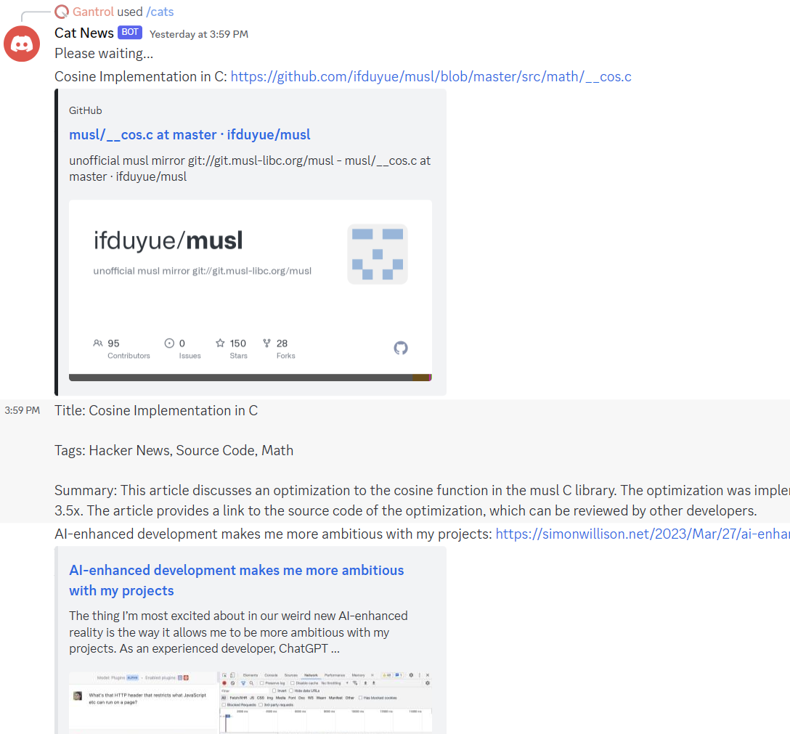
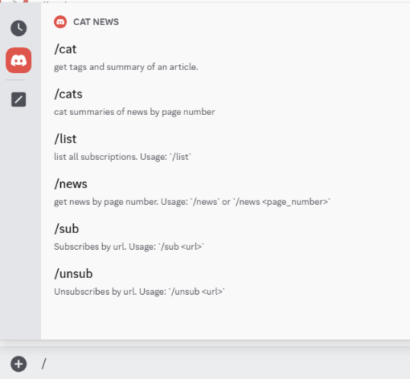

# CatNews: Don't Read, Just "Cat"

This is a Discord bot with an RSS RESTful backend integrated with the OpenAI API.

## Introduction

"cat" means getting summaries and tags of news. "cats" means getting a list of them.



Over 95% of the code was written by AI.

### Login with Discord

> You should get the URL of a running server instantly first. See the `Developing` or `Deploying` section below.

After authentication at `<Your_Server_URI>/auth/discord/`, it will redirect to the `DISCORD_REDIRECT_URL` you configured in `.env`.

### Commands

First, use `/sub <url_with_rss>`, and then use `/news` or `/cats`.

Here are all the available commands:



### API docs

Visit `<Your_Server_URL>/docs`.

## Developing

Create a `.env/` file with the `.env_example`.

> Don't commit your `.env` file to git. You can check [this link](https://github.com/search?q=%2Fsk-[A-z0-9]{40}%2F&type=code) for the reason.

### Discord Configurations

Following the video in [this article](https://pythoninoffice.com/building-a-simple-python-discord-bot-with-discordpy-in-2022-2023/), you can get the following variables:

```
CLIENT_ID_DISCORD=
CLIENT_SECRET_DISCORD=
REDIRECT_URI_DISCORD=<Your_Server_URI>/auth/discord/callback
PERMISSIONS_DISCORD=
DISCORD_API=
```

You can modify `DISCORD_REDIRECT_URL` to your invite link of the channel or URL of the channel.

> If you encounter an error regarding `discord.com:443 ssl:default`, you may consider using GitHub codespace for bot development.

### OpenAI KEY

1. Go to: https://platform.openai.com/account/api-keys
2. Click the "Create new secret key" button.
3. Click the "Copy" button.
4. Paste it to the right of `OPEN_AI_KEY=` in `.env`.

### Test

> Only basic API tests are available for now.

```
python -m pytest
```

## Deploying

You can use [Railway](https://railway.app/new) for quick deployment. Note that you should use an external DB instead of SQLite by default, or your data will be removed each time you deploy to Railway.

You can also deploy Postgres in [Railway](https://railway.app/new).
